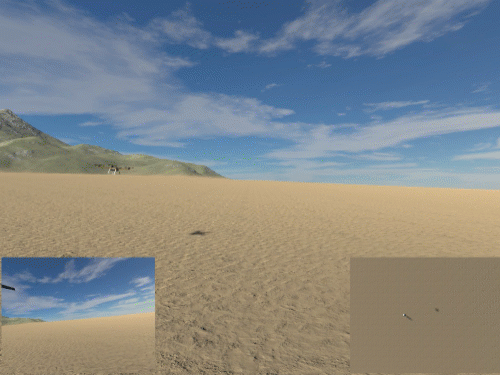

# autonomous-systems

In the repo you will find the 3 assignments given during the Autonomous Systems course @ TUM.

#### Table of contents
1. [ROS Basics](https://github.com/lucadallesasse/autonomous-systems/tree/main/autsys-2022-ros-basics)
2. [Geometric Tracking Controller](https://github.com/lucadallesasse/autonomous-systems/tree/main/autsys-2022-geometric-controller)
3. [Trajectory Generation](https://github.com/lucadallesasse/autonomous-systems/tree/main/autsys-2022-trajectory-generation)

