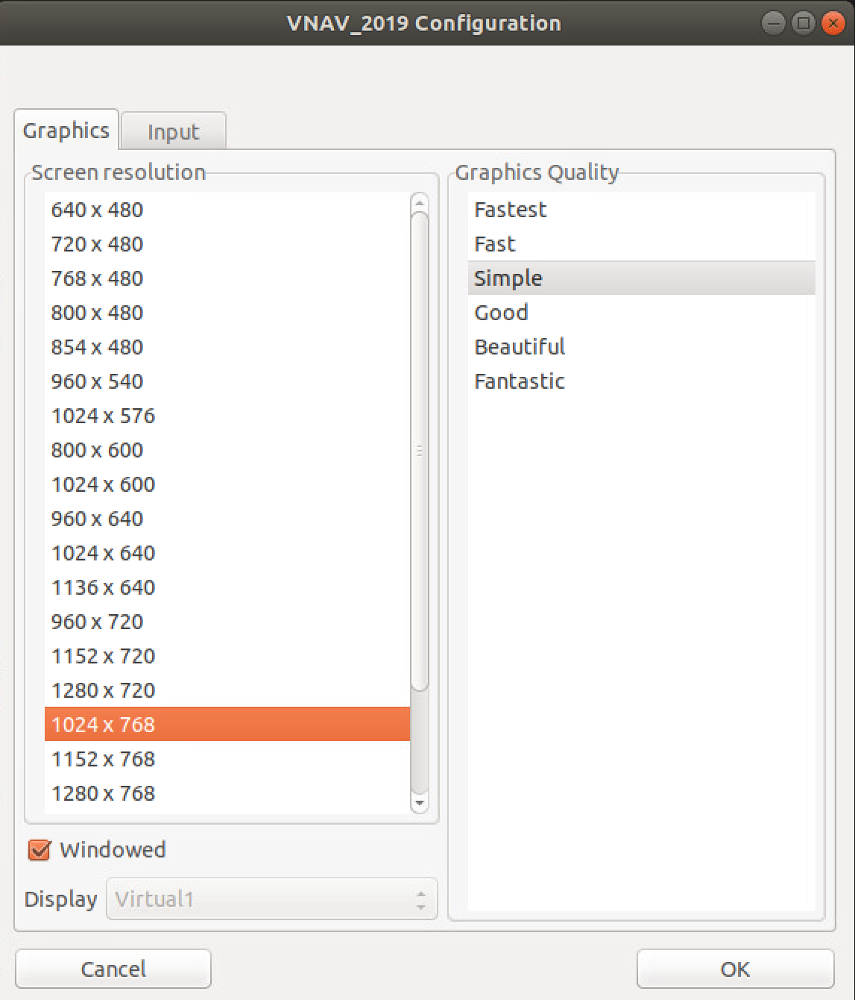
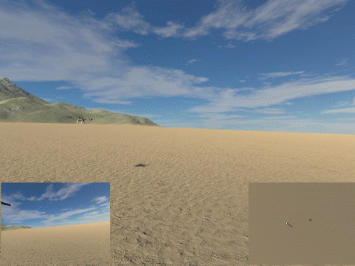
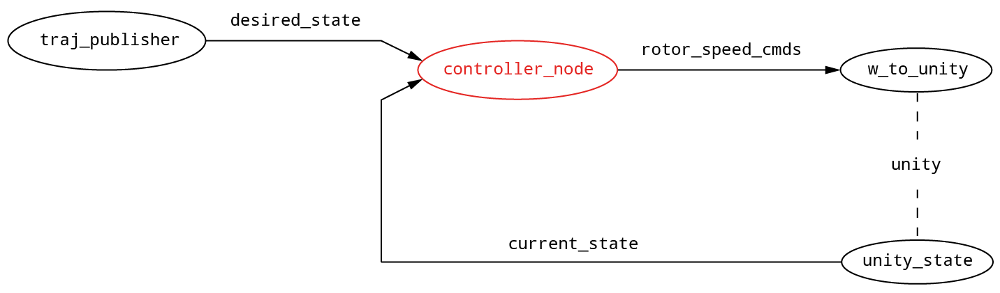
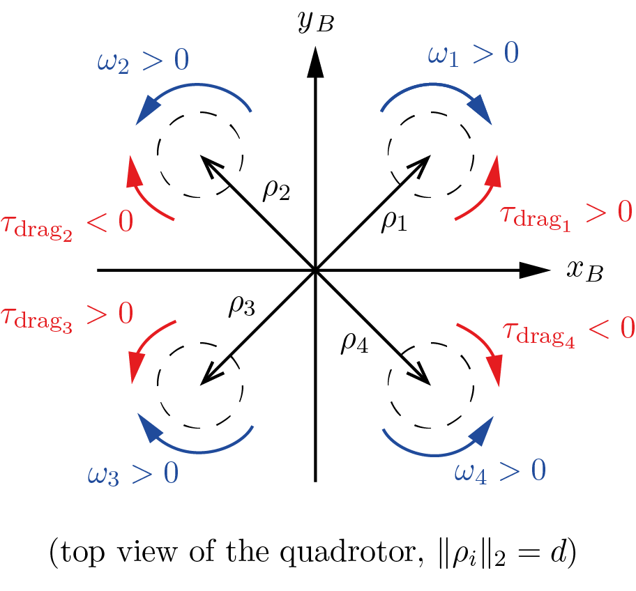
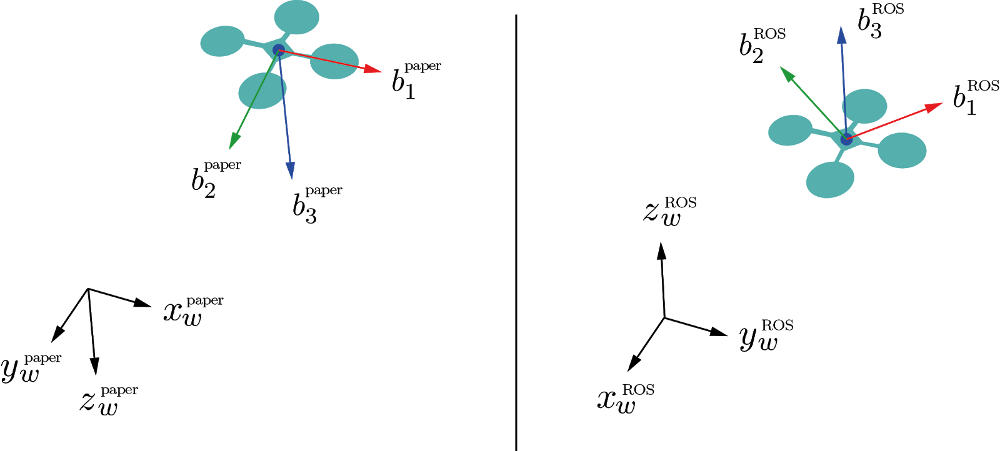

# TUM LRG 6300 Autonomous Systems

## Assignment - Geometric Tracking Controller

#### Table of contents
1. [Trajectory tracking for UAVs](#trajtrack)
   1. [The Codebase](#codebase)
   1. [Launching the Unity simulator](#unity)
2. [Implement the controller](#controller_impl)
   1. [Simulator conventions](#simconvs)
3. [Exercise](#exercise)


There are several tasks to complete.
Find them in chapter 3.
__Please make sure to read the full documentation beforehand.__

### 1 Trajectory tracking for UAVs <a name="trajtrack"></a>
In this section, we are going to implement the geometric controller discussed in class on a simulated drone.

#### 1.1 The Codebase <a name="codebase"></a>
We now have the unity_bridge and the controller_pkg folders, which are both ROS packages. 
Additionally we need to clone an external package from the ETH Zurich, that defines the used ROS messages for communicating with the quadrotor. 
Go to the `/src` folder and add it using
```shell
git submodule add https://github.com/ethz-asl/mav_comm.git
```

You will then need to add the `.gitsubmodules` file to your GitLab on the next commit. Remember to run `git submodule init` and `git submodule update` when you clone the repo.
Now it is time to build your workspace.

```shell
catkin build
source devel/setup.bash
```

Note: the call to catkin build can take some time since it needs to compile some dependencies and download the simulation.

#### 1.2 Launching the Unity simulator <a name="unity"></a>
Once the workspace has been compiled successfully, with your workspace sourced execute:
```shell
roslaunch unity_bridge unity_sim.launch
```


First, a pop-up window appears (Fig. below) where you can tweak some graphic settings and confirm. Select a screen resolution and a graphics quality you like, I suggest selecting the Windowed checkbox to help debug your rosnode.




In the simulator, you can:
- use your middle mouse button to rotate the view 
- use the keyboard arrows to translate your view. Effectively, this also moves a pill-shaped character in the scene, which can physically interact with the quadrotor. 
- use space on your keyboard to have your pill character jump, which should help you hit the quadrotor


### 2. Implement the controller <a name="controller_impl"></a>
From the previous section, you must have noticed that the drone is stationary. Unsurprisingly, this happens because the UAV is not receiving any control inputs. In this section, you will be precisely asked to take care of it!

Given four propeller speeds, the simulator propagates forward the UAV dynamics and outputs the current state of the robot. 
It is your job now to provide the propeller speeds based on the current state of the robot (from the simulator) and a 
desired one (from a trajectory generator). 
This problem is extensively described in the geometric controller paper [“Geometric tracking control of a quadrotor UAV on SE (3)”](http://math.ucsd.edu/~mleok/pdf/LeLeMc2010_quadrotor.pdf) 
by Lee et al, where the authors introduce an almost-globally convergent geometric controller for a quadrotor, also outlined in class. We will ask you to read the paper thoroughly and implement this controller in ROS.

For the purposes of this lab, the trajectory generator is given by the traj_publisher node, which outputs a time-varying desired state along a hard-coded circular trajectory. The navigation stack (almost) implemented in our codebase has the architecture shown below, where the ROS nodes are highlighted as vertices in the graph and the ROS topic names are reported on the edges.



In particular:
- /desired_state is of type trajectory_msgs/MultiDOFJointTrajectoryPoint and has the following fields:
  - `transforms` - type `geometry_msgs/Transform`:
    - translation: a 3D vector with the desired position of the c.o.m. in the world frame
    - rotation: a quaternion representing a rotation (in our case it will be only a yaw component)
  - `velocities` - type `geometry_msgs/Twist`:
    - linear: a 3D vector with the desired velocity of c.o.m. in world frame 
    - angular: we will ignore this field as it is not used by the controller 
  - `accelerations` - type `geometry_msgs/Twist`:
    - linear: a 3d vector with the desired acceleration of c.o.m. in world frame 
    - angular: we will ignore this field as it is not used by the controller
- `/current_state` is of type `nav_msgs/Odometry` with the relevant fields:
  - `pose.pose` - type `geometry_msgs/Pose`:
    - position: a 3d vector with the current position of the c.o.m. in the world frame 
    - orientation: a quaternion representing the current orientation of the UAV 
  - `twist.twist` - type `geometry_msgs/Twist`:
    - linear: a 3d vector with the current velocity of c.o.m. in the world frame 
    - angular: a 3d vector with the current angular velocity in the world frame
- `/rotor_speed_cmds` is of type `mav_msgs/Actuators` and it contains the relevant field:
  - angular_velocities - type float64[], containing the desired speeds of the propellers.


#### 2.1 Simulator conventions <a name="simconvs"></a>
In the picture below, we illustrate the conventions used in unity simulator for the propeller speeds and their positions in the body frame. Please look carefully as this will help you build the correct wrench-to-controls matrix (F2W) in the coding assignment.



Note that
- as in most research papers, we assume that, for $\omega_i$, all the propellers produce an upward force (lift). This is consistent with the first row of the matrix in eq. (3.9) on the lecture notes 
- in the figure, we show the positive spinning directions for the propellers (blue) and the resulting direction of the yaw torques generated by aerodynamic drag. For example: propeller 1’s angular velocity $\omega_1$
is considered positive when propeller 1 spins clockwise (as seen from top), which in turn produces a counter-clockwise drag torque $\boldsymbol \tau_{drag_1}$.
- the spinning directions are different from the paper and the lecture notes. The expression $\boldsymbol \tau_{drag_i}$
implies that the drag on propeller 1 produces a negative (clockwise) yaw torque instead, for $\omega$. However, the above convention is acceptable: propellers are mounted differently in the simulated quadrotor!
- the propeller speeds need to be provided in radians per second (rad/s), NOT in rpm. Initially, it will be tempting to go for the latter, as it will make the drone move more easily (control inputs get bigger), however, it will hurt you in the long run.

Before proceeding, keep in mind that there are a number of caveats that will make the math in your code slightly different from the one found in the paper. The main differences can be summarized as follows:

__Reference frames:__ The paper and your code use different conventions for coordinate frames. Please refer to the figure and pay attention to the two main facts summarized below.



- In the paper, the -axes - both in the world and body frames - are downwards, while ROS has them pointing upwards. This affects the signs of $\boldsymbol b_{r_d}$
in equation (12), as well as gravity and aerodynamic forces in equations (12), (15), (16). (equation numbers refer to the paper 1).
- In the paper, the $x$-body axis is along a propeller arm, while we prefer having it at $45^\circ$ between two propellers. This will require some thought on your end when converting the total desired force + torques (wrench) into the desired propeller speeds. In other words, you have to change equation (1) from the paper. For this step, refer to equation (3.9) in the lecture notes!

__Aerodynamic coefficients:__ In the paper, equation (1), the quantity relates directly the yaw torque with the lift produced by a propeller. In contrast, we prefer using the lift and drag coefficients and, which have a clearer physical interpretation. Consider the relation
between these coefficients.

### 3. Deliverable <a name="exercise"></a>
After reading the reference (see paper above) - __thoroughly__ - open the source file `controller_node.cpp`.
In this file, you will find detailed instructions to fill in the missing parts and make your quadrotor fly!

Please implement the following:

1) declare ROS callback handlers
2) initialize ROS callback handlers
3) set objective
   1) position
   2) yaw
4) fill in x, v, R and omega
5) Implement the controller
   1) Compute position and velocity errors
   2) Compute the Rd matrix
   3) Compute the orientation error and the rotation-rate error
   4) Compute the desired wrench to control the UAV.
   5) Recover the rotor speeds from the wrench computed above
   6) Populate and publish the control message
6) Tune your controller
   1) move hard-coded gains from line 145-148 to the yaml file in /config
   2) write your first .launch file and load parameters from yaml file

      -> like this, you will not have to rerun catkin build every time you change a parameter
   3) add package dependency as submodule (compare description)

      -> now you can run catkin build
   4) tune your controller - Depending on your focus - and degree of luck - it will take several attempts to have a stable and smooth controller and multiple iterations of parameter tuning. That’s normal!


Once you are ready to compile your code, run:
```shell
catkin build
```
from your catkin workspace.

To try out your code, launch the simulator. 
```shell
roslaunch unity_bridge unity_sim.launch
```

Additionally, run your controller by typing, in a separate terminal:
```shell
rosrun controller_pkg controller_node
```
Note: we use rosrun here. You will write a .launch file for this node in 6-ii.

As a suggestion, you could start by testing a stationary waypoint, before moving to the circular trajectory. 
This is possible by switching the STATIC_POSE flag to 1 in `traj_publisher.cpp`. 
Also, you should use rViz to visually compare the desired and the current poses. 
When you are able to track the circular trajectory, try hitting your UAV with your pill-like alter-ego to test the stability of your controller.

__What to expect:__
If your controller is working reasonably well we expect to see something like this:


__Note:__ it is totally fine if the drone does a rapid maneuver to start tracking the circle as soon as you run the controller node.

Good luck!

