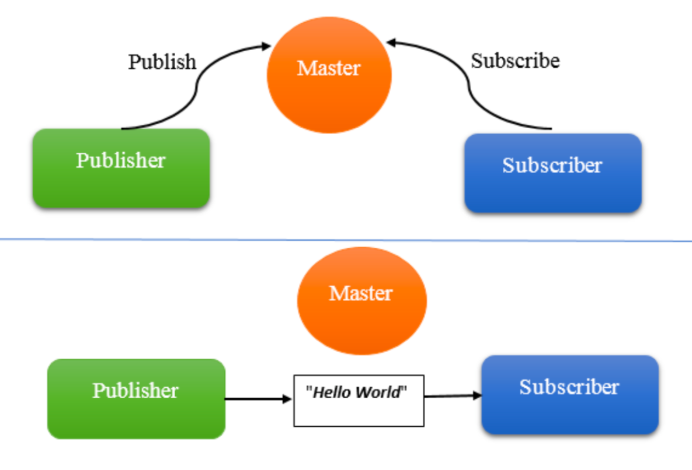
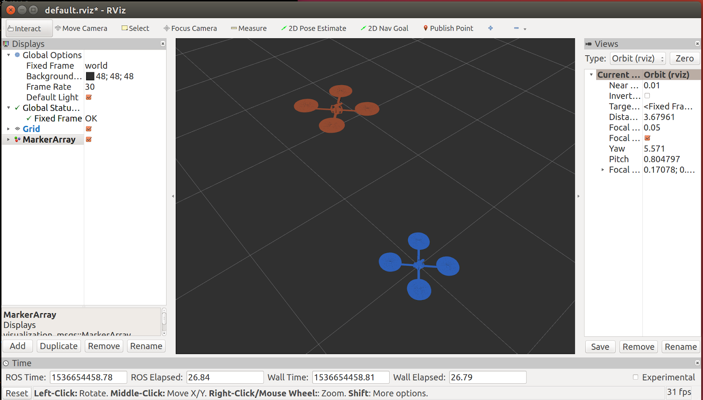
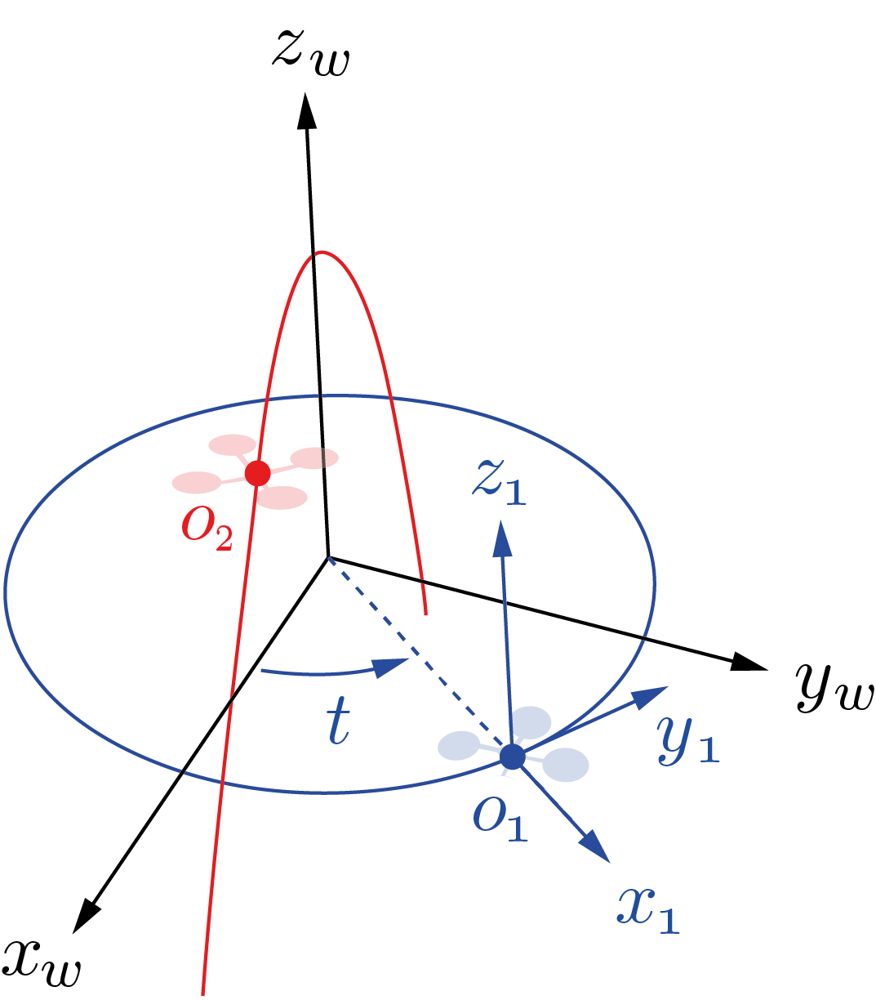
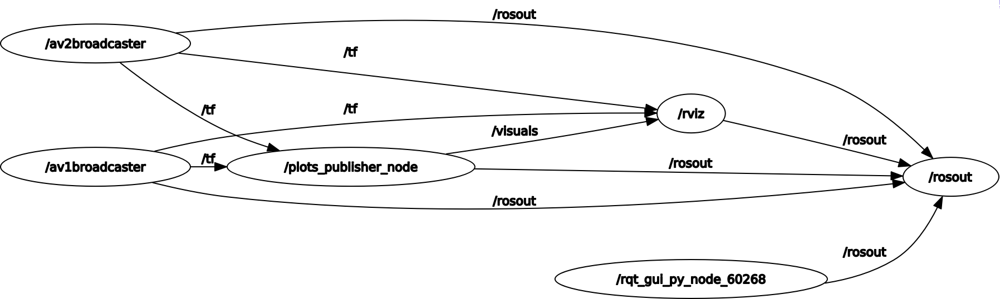
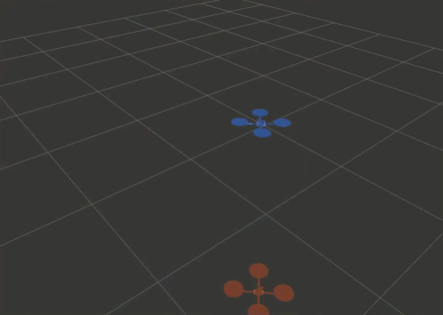

# TUM LRG 6300 Autonomous Systems

## Assignment - ROS Basics

#### Table of contents
1. [Installing ROS](#introduction)
2. [ROS Intro](#ros_intro)
    1. [File system structure](#file_system_structure)
    2. [ROS Master, Nodes & Topics](#ros_master_nodes_topics)
    3. [Anatomy of a ROS node](#anatomy)
    4. [Launch Files](#launchfiles)
3. [Exercise](#exercise)
   1. [Building the Code](#building)
   2. [A two-drone scenario](#twodrones)
   3. [Problem formulation](#problem)
   4. [Basic ROS Commands](#basicros)
   5. [Publishing Transforms](#publishing)

There are three tasks to complete.
__Please make sure to read the full documentation beforehand.__

### 1 Installing ROS <a name="introduction"></a>

Follow the instructions at the [official documentation](http://wiki.ros.org/ROS/Installation). 
Please make sure to have Ubuntu 20.04 and ROS Noetic (a.k.a. ROS 1) on your system. 
Please also install the python catkin tools using `sudo apt-get install python3-catkin-tools`. 

### 2 ROS Intro <a name="ros_intro"></a>


#### 2.1 ROS file system structure <a name="file_system_structure"></a>
2.1.1 General Structure

Similar to an operating system, ROS files are also organized in a particular fashion. The following graph shows how ROS files and folder are organized on the disk:
The ROS packages are the most basic unit of the ROS software. They contain the ROS runtime process (nodes), libraries, configuration files, and so on, which are organized together as a single unit. Packages are the atomic build item and release item in the ROS software.
Inside a package we can find the package manifest file, which contains information about the package, author, license, dependencies, compilation flags, and so on. The `package.xml` file inside the ROS package is the manifest file of that package.
The ROS messages are a type of information that is sent from one ROS process to the other. They are regular text files with `.msg` extension that define the fields of the messages.
The ROS service is a kind of request/reply interaction between processes. The reply and request data types can be defined inside the `srv` folder inside the package.
For example, the package we will develop in this lab will be like

```
.
    two_drones_pkg
        CMakeLists.txt
        README.md
        config
            default.rviz
        launch
            two_drones.launch
        mesh
            quadrotor.dae
        package.xml
        src
            frames_publisher_node.cpp
            plots_publisher_node.cpp
```

2.1.2 The workspace

In general terms, the workspace is a folder which contains packages, those packages contain our source files and the environment or workspace provides us with a way to compile those packages. It is useful when we want to compile various packages at the same time and it is a good way of centralizing all of our developments.

#### 2.2 ROS Master, nodes and topics <a name="ros_master_nodes_topics"></a>
One of the primary purposes of ROS is to facilitate communication between the ROS modules called nodes. Those nodes can be executed on a single machine or across several machines, obtaining a distributed system. The advantage of this structure is that each node can control one aspect of a system. For example you might have several nodes each be responsible of parsing row data from sensors and one node to process them.

2.2.1 ROS Master

Communication between nodes is established by the ROS Master. The ROS Master provides naming and registration services to the nodes in the ROS system. It is its job to track publishers and subscribers to the topics.
The ROS master works much like a DNS server. Whenever any node starts in the ROS system, it will start looking for the ROS master and register the name of the node with it. Therefore, the ROS master has information about all the nodes that are currently running on the ROS system. When information about any node changes, it will generate a callback and update it with the latest information.



The ROS Master distributes the information about the topics to the nodes. Before a node can publish to a topic, it sends the details of the topic, such as its name and data type, to the ROS master. The ROS master will check whether any other nodes are subscribed to the same topic. If any nodes are subscribed to the same topic, the ROS master will share the details of the publisher node to the subscriber node.
After receiving the node details, these two nodes will interconnect using the TCPROS protocol, which is based on TCP/IP sockets, and ROS master will relinquish its role in controlling them.
To start the ROS master, open a terminal and run

```CPP
roscore
```

Any ROS system must have only one master, even in a distributed system, and it should run on a computer that is reachable by all other computers to ensure that remote ROS nodes can access the ROS master.


#### 2.3 Anatomy of a ROS node <a name="anatomy"></a>

The simplest C++ ROS node has a structure similar to the following
```CPP
#include "ros/ros.h"
int main(int argc, char **argv) {
  ros::init(argc, argv, "example_node");
  ros::NodeHandle n;
  ros::Rate loop_rate(50);
    while (ros::ok()) {
    // ... do some useful things ...
    ros::spinOnce();
    loop_rate.sleep();
    }
  return 0;
}
```

Let’s analyze it line by line: the first line
```CPP
#include "ros/ros.h"
```
adds the header containing all the basic ROS functionality. At the beginning of the `main()` of the program
```CPP
 ros::init(argc, argv, "example_node");
```

`ros::init` initializes the node, it is responsible for collecting ROS specific information from arguments passed at the command line and set the node name (remember: names must be unique across the ROS system). But it does not contact the master. To contact the master and register the node we need to call

```CPP
 ros::NodeHandle n;
```

When the first `ros::NodeHandle` is created it will call `ros::start()`, and when the 
last `ros::NodeHandle` is destroyed (e.g. goes out of scope), it will call 
`ros::shutdown()`. This is the most common way ot handling the lifetime of a ROS node.

Usually we want to run our node at a given frequency, to set the node frequency we use
```CPP
 ros::Rate loop_rate(50);
```
which is setting the desired rate at 50 Hz. 
Then, we have the main loop of the node. 
Since we want to run this node until ROS shutdown, we need to the check the various states of the system. 
The most common way to do this is to call `ros::ok()`. 
Once `ros::ok()` returns false, the node has finished shutting down. 
That’s why we have
```CPP
while (ros::ok()) {
    // ...
}
```
Inside the loop we can make interesting thing happen. In our example we simply run
```CPP
ros::spinOnce();
loop_rate.sleep();
```

The function `ros::spinOnce()` will call all the callbacks waiting to be called at that point in time. 
If you remember, we set the node frequency to 50Hz, the code we are running will probably take less than 20ms. 
The function loop `rate.sleep()` will pause the node the remaining time.

#### 2.4 Launch files <a name="launchfiles"></a>
Launch files are the preferred way to run ROS nodes. The launch files provide a convenient interface to execute multiple nodes and a master (if it is not already running), as well as other initialization requirements such as parameters.
Usually the launch files are located in the launch folder of the package and have `.launch` extension. If the package provides one, you can use roslaunch to use it.

```XML
roslaunch <package_name> <launch_file>
```

Note: Pushing `CTRL+c` in a terminal with a launch file running will close all nodes that were started with that launch file.
An example of launch file is

```XML
<launch>
  <node name="map_server" pkg="map_server" type="mapserver" />
  <node name="stageros" pkg="stage" type="stageros" args="$(find navigation_stage)/stage config/worlds/willow-pr2-5cm.world" >
<param name="base_watchdog_timeout" value="0.2"/>
</node>
  <include file="$(find navigation_stage)/move_base_config/amcl_node.xml"/>
</launch>
```

This example will run three nodes (plus the master if not already running), each node is equivalent to a rosrun call, for example

```XML
<node name="stageros" pkg="stage" type="stageros" args="$(find navigation_stage)/stage 􏰀→ config/worlds/willow-pr2-5cm.world" />
```
is equivalent to
```BASH
rosrun stage stageros <path-to-navigation-stage-package>/stage_config/worlds/willow-pr2-5cm.world
```


This tool gives the possibility to add complex and dynamic runtime behavior such as `$(find path)`, `unless`- and `if`-statements or including other launch files.

### 3 Exercise <a name="exercise"></a>

#### 3.1 Building the code <a name="building"></a>
Building the code is as easy as navigating to the `catkin_ws` directory and running `catkin init`:

```Shell
$ cd /catkin_ws/
$ catkin init
Initializing catkin workspace in `/home/antonap/as_ws`.
--------------------------------------------------------------
Profile:                     default
Extending:             [env] /opt/ros/melodic
Workspace:                   /home/antonap/as_ws
--------------------------------------------------------------
Build Space:       [missing] /home/antonap/as_ws/build
Devel Space:       [missing] /home/antonap/as_ws/devel
Install Space:      [unused] /home/antonap/as_ws/install
Log Space:         [missing] /home/antonap/as_ws/logs
Source Space:       [exists] /home/antonap/as_ws/src
DESTDIR:            [unused] None
--------------------------------------------------------------
Devel Space Layout:          linked
Install Space Layout:        None
--------------------------------------------------------------
Additional CMake Args:       None
Additional Make Args:        None
Additional catkin Make Args: None
Internal Make Job Server:    True
Cache Job Environments:      False
--------------------------------------------------------------
Whitelisted Packages:        None
Blacklisted Packages:        None
--------------------------------------------------------------
Workspace configuration appears valid.
--------------------------------------------------------------
```

Then build your code by running
```Shell
catkin build
```

Now that you built the code you see that catkin added a bunch of new folders. 
In order to use our workspace, we need to make ROS aware of all the components by sourcing the corresponding environment. 
This is done by running the following in __every single terminal__ where you intend to use the workspace:

```Shell
source devel/setup.bash
```

For the rest of the assignment, we assume that you are performing this operation whenever necessary.

#### 3.2 A two-drone scenario <a name="twodrones"></a>
In this part, we are going to work with 3D Rigid Transformations and with tf, a basic tool provided by ROS to keep track of multiple coordinate frames over time.
To get started, let’s go back to the catkin workspace and bring up the two-drones static scenario. 
In this environment, we have two aerial vehicles, AV1 [blue] and AV2 [red] that are not moving, 
but it serves as a good starting point! 
With the catkin workspace sourced in a terminal, run:

```Shell
roslaunch two_drones_pkg two_drones.launch static:=True
```

You should see the following window, which shows the initial positions of the two AVs.



This window is rViz, the mighty ROS visualizer! 
Just like most processes in the ROS ecosystem, rViz is a ROS node. 
Like all other nodes, rViz can subscribe to ROS topics. 
However, its specialty is converting them into graphics on your screen to display the state of your robotic system.

As a first experience with rViz, let us:

- Add the visualization of \tf. In the Displays panel, click "Add", select the "By display type Tab" in the pop-up and finally select “TF” and confirm with Ok. You should see all the reference frames, with names and their axes represented in red (x), green (y) and blue (z).
- Save the configuration file that we don’t have to repeat the step above every time we launch rVIZ! Hit CTRL + s or select "File" $>$ "Save Config".

Other published topics can be added to the visualizer in a similar way.

#### 3.3 Problem formulation <a name="problem"></a>
We consider the scenario illustrated in the picture below, where two aerial vehicles, AV1 [blue] and AV2 [red] are following different trajectories: 
a circle and a parabolic arc, respectively. 
In the scene, we have highlighted the following elements:

- The world frame [x, y, z]_w
- The AV1 body frame, centered in O_1 with axes x_1 y_1, z_1
- The origin of AV2, denoted with O_2 with axes x_2, y_2, z_2



**Positions:**

In the world frame, AV1 and AV2’s origins are given by:
- o_1^w = [cos(t), sin(t), 0]^T
- o_2^w = [sin(t), 0, cos(2t)]^T

where t denotes time.

**Orientations:**
We will make the following simplifying assumptions:

- AV1’s reference frame is such that y_1 stays tangent to AV1’s trajectory for all t and z_1 is parallel to z_w for all t (i.e., equivalently, roll = pitch = 0, yaw = t)
- AV2’s reference frame moves with pure translation and we can assume that its axes are parallel to the world axes for all times t.

**Note:**
- Given the dynamics of a quadrotor, these motions are dynamically infeasible. However, for the purpose of this lab, we disregard this fact and focus on the study of rigid transformations
- To make the math of this problem more interesting, we chose the y_1 axis to point in the direction of motion of the drone. However, do not forget that the standard convention is that x_1 should point forward!

In the sequel, we reproduce the above scenario in ROS and study the trajectory of AV2 relative to AV1’s coordinate frame.

#### 3.4 Basic ROS commands <a name="basicros"></a>
##### 3.4.1 Task 1 - Nodes, topics, launch files

With the roslaunch command above we have spawned a number of ROS nodes at the same time. 
Answer the following questions for yourself to get a better understanding of ROS:

1. List the nodes running in the two-drone static scenario.

NODES:
    av1broadcaster (tf/static_transform_publisher)
    av2broadcaster (tf/static_transform_publisher)
    plots_publisher_node (two_drones_pkg/plots_publisher_node)
    rviz (rviz/rviz)

__Hint__: you can directly inspect the launch file or get some help from `rqt_graph`. You will notice that rViz is initially not shown in it but you can uncheck the Debug option for a full picture, feel free to ignore all \rosout nodes and topics and \rqt\_gui\_py\_* that may appear.



2. How could you run the two-drone static scenario without using the roslaunch command? List the commands that you would have to execute, in separate terminals, to achieve the same result.
__Hint__: rosrun [...], try things out before finalizing your answer!

Execute every line in a different terminal:
roscore
rosrun rviz rviz
rosrun tf static_transform_publisher 1 0 0 0 0 0 1 world av1 100
rosrun tf static_transform_publisher 0 0 1 0 0 0 1 world av2 100
rosrun two_drones_pkg plots_publisher_node 

3. List the topics that each node publishes and subscribes to. What nodes are responsible for publishing the av1, av2 frames? Which topic causes rViz to plot the drone meshes?
__Hint__: uncheck items on the left pane in rViz until the meshes disappear, then check what node is publishing the corresponding topic

Published topics:
 * /rosout_agg [rosgraph_msgs/Log] published by rosout
 * /rosout [rosgraph_msgs/Log] published by rViz, av1broadcaster, av2broadcaster, plots_publisher_node
 * /tf [tf2_msgs/TFMessage] published by av1broadcaster, av2broadcaster 
 * /visuals [visualization_msgs/MarkerArray] published by plots_publisher_node (this topic causes rViz to plot the drone meshes)
 * /initialpose [geometry_msgs/PoseWithCovarianceStamped] published by rViz
 * /move_base_simple/goal [geometry_msgs/PoseStamped] published by rViz
 * /clicked_point [geometry_msgs/PointStamped] published by rViz

Subscribed topics:
 * /rosout [rosgraph_msgs/Log] subscribed by rosout
 * /tf [tf2_msgs/TFMessage] subscribed by rViz, plots_publisher_node
 * /tf_static [tf2_msgs/TFMessage] subscribed by rViz, plots_publisher_node
 * /visuals [visualization_msgs/MarkerArray] subscribed by rViz

 av1broadcaster and av2broadcaster are the two nodes responsible for publishing av1 and av2 frames. 


4. What changes if we omit static:=True? Why? __Hint__: check out and briefly explain the `if` and `unless` keywords in the launch file.

If we omith static:=True we are not able to visualize the movement of the reference frames and of the drones. Looking at the launch file we can in fact observe that the Transform publishers (static_transform_publisher) are enabled only if the variable static is set to True. The node frames_publisher_node is activated only if the static variable is not set to True (according to the 'unless' keyword).

#### 3.5 Let’s make things move! Publishing the transforms using tf <a name="publishing"></a>
After exploring the static scenario, it’s time to implement the motions described in the problem formulation section and visualize them in rViz. 
With the editor of your choice, open `frames_publisher_node.cpp` in the src folder of two_drones_pkg. 
In this file, we provide a basic structure of a ROS node.

##### 3.5.1 Some Context
Please take your time to familiarize with this code before modifying it. Although not mandatory, the pattern found in it is a very common way to implement ROS nodes:
- The node’s source code is encapsulated into a class, FramesPublisherNode (line 6), which keeps a nodeHandle as a private member.
- In the constructor of the class (lines 14 to 19), one performs operations that need to be executed only once upon startup (e.g. typically, initializing subscribers and publishers),
- Using a Timer (lines 10 and 17), the `onPublish()` method is called periodically - at a 50Hz - and all the operations within it are performed ad libitum,
- In the body of main() (towards the end of the file):
  - the node is registered with `ros::init(...)`
  - an instance of the node class is created
  - a blocking call to `ros::spin()` is issued, which starts ROS’s main loop.
  
##### 3.5.2 Task 2 - Publishing transforms
In `frames_publisher_node.cpp`, follow the instructions in the comments and fill in the missing code. Your objective is to populate the provided AV1World and AV2World variables to match the motions described in the problem formulation. These objects are instances of the `tf::transform` class, which is ROS jargon for a homogeneous transformation matrix.

**Keep in mind:** Ensure that the orientation of the AV1 frame is in accordance with the assumptions made in the problem formulation, as this is of crucial importance for the final result!

***How to test:*** Once you are ready to compile your code, run:
```Shell
catkin build
source devel/setup.bash
```

from the workspace folder.

To try out your code, launch the two-drone scenario in non-static mode, i.e. run:
```Shell
roslaunch two_drones_pkg two_drones.launch
```

**What to expect:**
You should finally see the drones moving! Check that the trajectories reflect those illustrated in the figure in the problem formulation.



##### 3.5.3 Changing the rViz fixed reference frame
As mentioned, we are interested in the motion of AV2 relative to AV1’s reference frame. 
In the Displays panel (left, by default), under the Global Options section, rViz offers the possibility to change the Fixed Frame to any frame published in tf. 
Try it out yourself and change “world” into “av1” by typing in the corresponding field. 
From this perspective, AV1 appears static, the world frame spins around its $z$ axis and AV2 seems to be following a closed-curve trajectory.

##### Task 3 - Looking up a transform
In `plots_publisher_node.cpp`, follow the instructions in the comments and fill in the missing code. 
Your objective is to populate the provided object, transform, with the relative transform between two given frames with names ref_frame and dest_frame.

Compile your code and try it out as previously explained.

**What to expect:**

You should eventually see three trajectories, namely:

- AV1’s trajectory [blue, solid] in the world frame (circle on the x-y plane)
- AV2’s trajectory [red, solid] in the world frame (parabola on the z-x plane)
- The trajectory of AV2 in AV1’s frame [red, dashed]. You should now have a strong hunch that this curve is a ellipse on a “slanted” plane!

**Note:** if the results you are observing do not seem to make sense, try swapping ref_frame and dest_frame when interrogating \tf.


